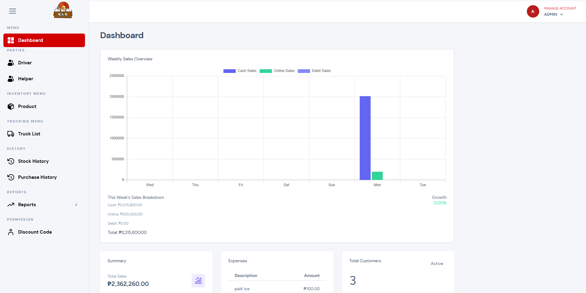
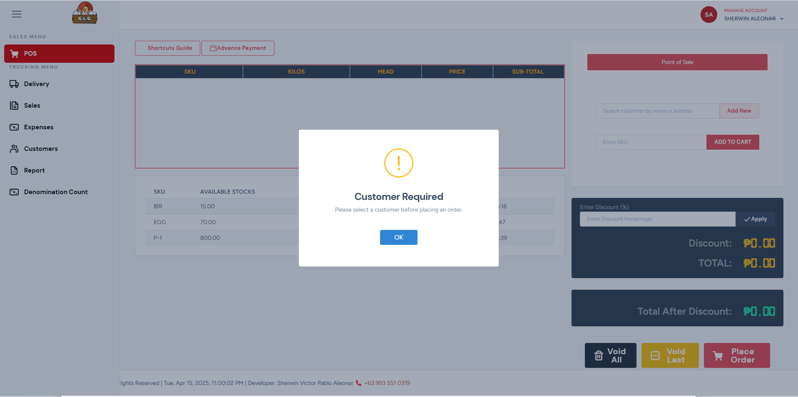
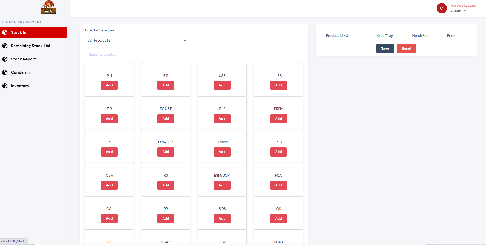
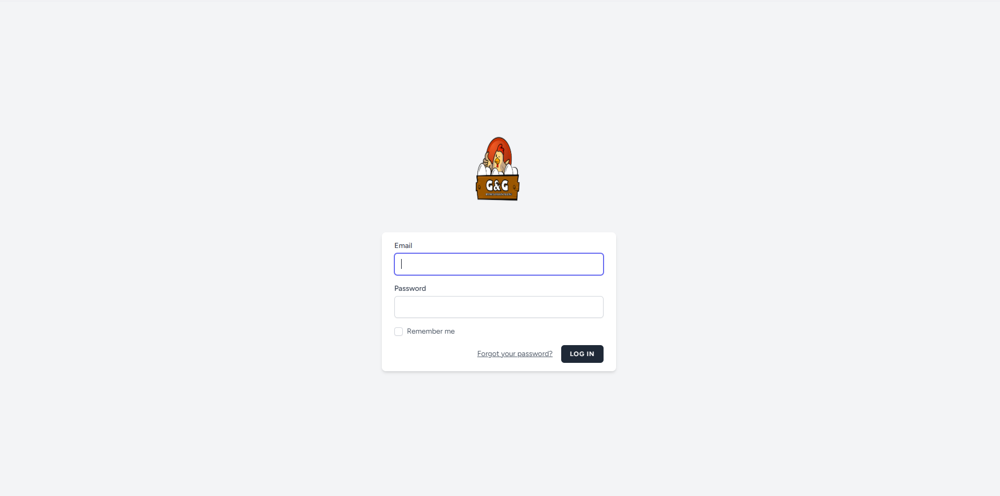

# Point of Sale (POS) System

A comprehensive Point of Sale system built with Laravel for retail and wholesale businesses.

## Features

-   **Sales Processing:** Easy transaction handling with customer selection and discount application
-   **Inventory Management:** Track stock levels, add new inventory, and manage product catalog
-   **Dashboard & Reporting:** Visual analytics for sales performance and financial tracking
-   **User Management:** Role-based access control (Admin, Clerk, etc.)
-   **Multi-payment Support:** Handle cash, online, and debit payments

## Screenshots

-   POS Transaction Interface
-   Inventory Management
-   Admin Dashboard with Analytics

## Tech Stack

-   **Backend:** Laravel
-   **Frontend:** Blade templates, JavaScript, CSS
-   **Database:** MySQL
-   **Authentication:** Laravel built-in auth

## Installation

### Requirements

-   PHP >= 8.0
-   Composer
-   MySQL
-   Node.js & NPM

### Setup Steps

1. Clone the repository

    ```
    git clone https://github.com/surewing15/GNG_PoS_System
    cd pos-system
    ```

2. Install dependencies

    ```
    composer install
    npm install
    ```

3. Environment setup

    ```
    cp .env.example .env
    php artisan key:generate
    ```

4. Configure database in .env file

    ```
    DB_CONNECTION=mysql
    DB_HOST=127.0.0.1
    DB_PORT=3306
    DB_DATABASE=pos_database
    DB_USERNAME=root
    DB_PASSWORD=
    ```

5. Run migrations and seeders

    ```
    php artisan migrate
    php artisan db:seed
    ```

6. Compile assets

    ```
    npm run dev
    ```

7. Start the server
    ```
    php artisan serve
    ```

## Usage

### Login Access

The system provides separate login access for different user roles:

#### Admin Login

-   URL: http://localhost:8000/admin/login
-   Default credentials:
    -   Email: admin@example.com
    -   Password: password
-   Full access to all system features, user management, and configuration

#### Cashier Login

-   URL: http://localhost:8000/cashier/login
-   Default credentials:
    -   Email: cashier@example.com
    -   Password: password
-   Access to POS interface, sales processing, and basic inventory checking

#### Clerk Login

-   URL: http://localhost:8000/clerk/login
-   Default credentials:
    -   Email: clerk@example.com
    -   Password: password
-   Access to inventory management, stock adjustments, and basic reporting

### Screenshots

To add screenshots of your login pages, save them in a `screenshots` folder and reference them like this:

```markdown




```

## License

This project is licensed under the MIT License - see the LICENSE file for details.

## Author

Your Name
